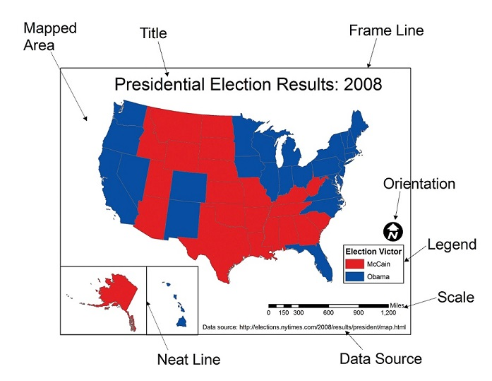

# MAP DESIGN BASICS: A FEW GOOD MAPS?
## GEOG 350: FALL 2017

### Donald J. Biddle
---
### The Plan
- What makes a good map?
- Purpose and Audience
- Thinking about design
- Map Elements
- The good, the bad, and the ugly...
---
### What's in a map?
 > A map is a symbolic representation of selected characteristics of a place, usually drawn on a flat surface. Maps present information about the world in a simple, visual way.
 > ###### -[National Geographic Society](https://www.nationalgeographic.org/encyclopedia/map/)
---
### What's in a map?
 > A *good* map delivers its information to the viewer in a clear and intuitive manner, in effort to convince, to present a case, or to tell a story. 
---
### What's in a map?
- [Key features of a *good* map](http://www.esri.com/news/arcuser/0112/make-maps-people-want-to-look-at.html):
 1. **Visual Contrast:** Data is the star of the show
 2. **Legibility:** Data are seen *and understood*. Selection of appropriate symbols/sizes is key.
 3. **[Figure-Ground Organization](https://blogs.esri.com/esri/arcgis/2011/02/15/graphic-design-principles-for-mapping-figure-ground-organization/):** Separation of main figure from background. 
 4. **Hierarchical Organization:** Within data layers themselves, and within map elements (title, north arrow, etc.)
 5. **Visual Balance:** Effective use of white space and positioning of visual elements within a layout .
---
### What and for Whom?
- Two most important questions you can ask when designing a map: 
 - What is the map's purpose?
 - Who is the audience? 
- The answers to these questions should shape the entire design process.
---
### Purpose
- Is your map...
 - Trying to help readers navigate roadways? 
 - Helping readers visualize terrain and topography?
 - Presenting information about the people that live in a city/state/country?
 - Showing the distribution of some phenomenon over Earth's surface? 
- Each of these purposes requires unique data, symbology, visual presentation, etc. 
- A thesis statement for your map.
---
### Audience
- Who is the primary viewership of your map?
 - The general public?
 - School children? 
 - Other geographers? 
 - The visually impaired?
- The design decisions you make should be based on assumptions about your intended audience.
- Example: Geographers will be familiar with interpreting census data in a standard deviation classification, but school children may not.  
---
### Thinking about design
- Beyond purpose and audience what are the key considerations?
 - Medium? Paper, PDF, Web? |
 - Appropriate scale? Detail vs study area extent |
 - Viewing distance? Wall map...6-9FT, Figure in paper...2FT |
 - Environment/Philosophy of use? Field map, wall map, office use |
---
### The Design Process
1. Define purpose and audience 
2. Select map scale 
3. Select medium, PoU, costs?? 
4. Abstraction/simplification of data 
 - Select, generalize, classify, symbolize 
5. Design the layout 
---
### Map Layout Elements

---
### Good Maps

---
### Good Maps

---
### Good Maps

---
### Good Maps

---
### Good Maps

---
### Bad Maps

---
### Bad Maps

---
### Bad Maps

---
### Bad Maps

---
### Designing Better Maps
> "It's all about matching perceptual dimensions with data dimensions" 
> - Cynthia Brewer
#####https://www.wired.com/2014/10/cindy-brewer-map-design/ 
--- 
### Adventures in Mapping
###### Blog by ESRI Cartographer John Nelson
###### https://adventuresinmapping.com/
---
### Closing Thoughts
###### "Principles of Cartographic Design"
###### of the British Cartographic Society
1. Concept before compliation
2. Hierarchy with harmony
3. Simplicity from sacrifice
4. Maximum information at minimum costs
5. Engage the emotion to engage the understanding
